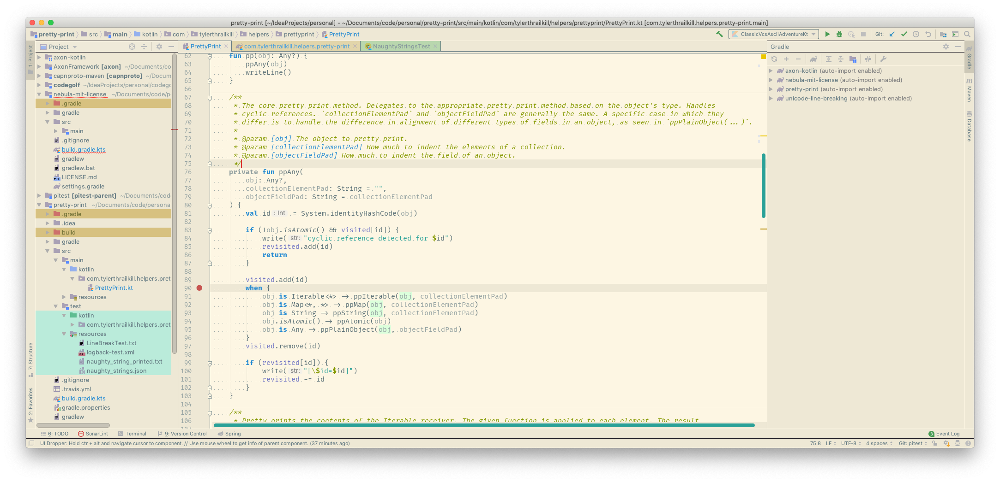
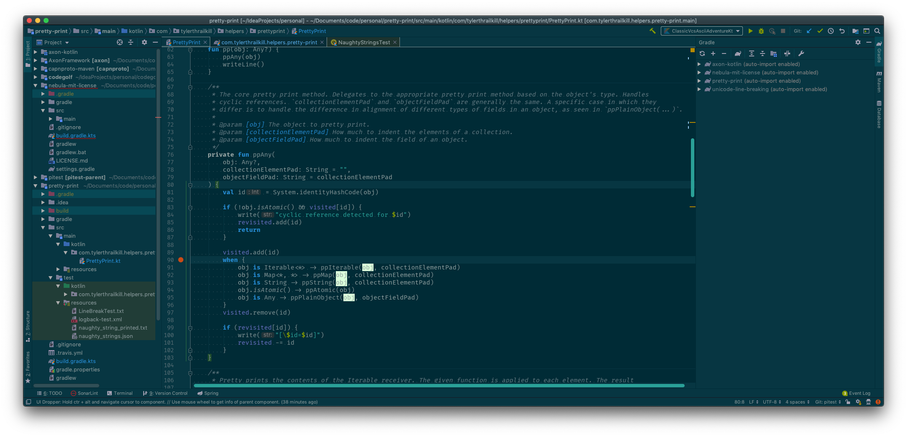

# Solarized JetBrains

Make your JetBrains IDE _completely_ solarized. 

Uses JetBrains new [custom theming](https://blog.jetbrains.com/idea/2019/03/brighten-up-your-day-add-color-to-intellij-idea/) to
add Solarized to the entire IDE. Only works in 2019.1+

# Contributing

Modify the `solarized_template.json` file and run `make` to build the appropriate themes. 
If you import the project using the included `*.iml` then the `Plugin` run configuration 
should include `make` as part of the build. 

# ToDo

* (dark) fix startup background color
* fix Markdown preview background

